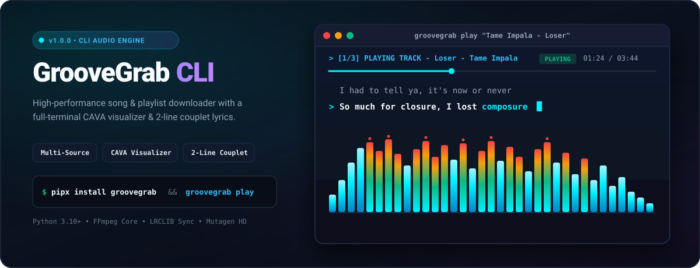
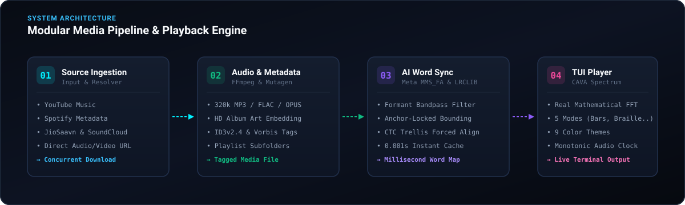

<p align="center">
  
</p>

<p align="center">
  <a href="#quick-start"></a>
  <a href="#quick-start"></a>
  <a href="#ai-word-level-lyric-sync"></a>
  <a href="LICENSE"></a>
</p>

---

## Overview

**GrooveGrab CLI** is a modular, high-performance music engine and terminal audio player built for power users, audiophiles, and command-line enthusiasts. It combines multi-threaded media downloading with an integrated CAVA spectrum visualizer, AI-powered word-level synced lyrics, and real-time MPRIS (Spotify) live lyrics tracking.

Whether downloading entire studio discographies, tracking live Spotify lyrics from your terminal, or enjoying music with reactive audio spectrum bars, GrooveGrab delivers an instantaneous, clean, and distraction-free audio experience.

---

## Key Features

- ⚡ **Multi-Provider Ingestion**: Download songs and playlists from YouTube Music, Spotify (metadata matching), JioSaavn, SoundCloud, and direct media URLs.
- 🎛️ **Studio Audio Transcoding**: Convert audio streams into high-bitrate **320kbps MP3**, lossless **FLAC**, **M4A**, or **OPUS** powered by FFmpeg.
- 🎨 **Automatic HD Tagging**: Automatically embeds high-resolution album cover artwork, artist, album, track numbers, release year, and genres via Mutagen.
- 📡 **Live Spotify &amp; MPRIS Lyrics**: Listens to active Spotify or Linux media playback over D-Bus (`MPRIS2`), tracking real-time position with continuous scrolling lyrics (`groovegrab lyrics`).
- 🧠 **AI Word-Level Lyric Sync**: Uses Meta AI's **MMS_FA** forced alignment model and vocal-formant filtering (`300Hz–3400Hz`) to sync lyrics word-by-word with millisecond precision.
- 📊 **CAVA Spectrum Visualizer**: Full-terminal mathematical FFT audio visualizer featuring multiple modes (*Bars*, *Braille*, *Waveform*, *Mirror*, *Particles*) across 9 curated color themes.
- 📁 **Smart Playlist Subfolders**: Automatically categorizes playlists and albums into dedicated folders while skipping already-downloaded tracks.
- ⚙️ **Interactive Setup Wizard**: Built-in interactive terminal wizard (`groovegrab setup`) with arrow-key menus for zero-friction configuration.

---

## Architecture &amp; Processing Pipeline

<p align="center">
  
</p>

---

## Quick Start

### 1. Prerequisites

Ensure you have **Python 3.10+** and **FFmpeg** installed on your system:

```bash
# Ubuntu / Debian
sudo apt update && sudo apt install -y ffmpeg

# Arch Linux
sudo pacman -S ffmpeg

# macOS (Homebrew)
brew install ffmpeg
```

### 2. Installation

Clone the repository and install GrooveGrab in editable mode:

```bash
git clone https://github.com/GopikChenth/GroveGrab-CLI.git
cd GroveGrab-CLI
pip install -e .
```

---

## Usage Guide

### 📡 Live Spotify &amp; MPRIS Synced Lyrics

Connect directly to your active Spotify (or any Linux MPRIS player) to stream live synchronized scrolling lyrics in your terminal:

```bash
# Live track Spotify lyrics in real time
groovegrab lyrics

# Or use the short alias
groovegrab spotify

# Target a specific player with custom theme
groovegrab lyrics --player spotify --theme cyberpunk
```

### 🎵 Play with CAVA Visualizer &amp; Synced Lyrics

Launch the full-screen terminal player with live audio spectrum and real-time typewriter lyrics (auto-downloads if not cached locally):

```bash
# Play by song name or search query
groovegrab play "The Weeknd - Blinding Lights"

# Play local audio file with custom visualizer theme and mode
groovegrab play "path/to/song.mp3" --theme cyberpunk --mode braille
```

### 📥 Download Songs &amp; Playlists

Download individual tracks, entire albums, or full playlists:

```bash
# Download from Spotify, YouTube Music, or direct link
groovegrab dl "https://open.spotify.com/playlist/37i9dQZF1DXcBWIGoYBM5M"

# Download with custom format and bitrate
groovegrab dl "Tame Impala - Let It Happen" --format flac
```

### 🔍 Interactive Song Search

Search songs across providers and interactively select tracks to download:

```bash
groovegrab search "Daft Punk - Get Lucky"
```

### ⚙️ Interactive Configuration Wizard

Configure default download directories, audio formats, bitrates, lyrics fetching, and concurrent downloads:

```bash
# Run interactive setup wizard
groovegrab setup

# Or manage settings via CLI flags
groovegrab config --dir ~/Music/GrooveGrab --format mp3 --bitrate 320k --concurrent 4
```

### 📜 Download Queue &amp; History

Inspect recent downloads and status logs:

```bash
groovegrab queue --limit 25
```

---

## 🎹 Terminal Player Hotkeys

During playback in `groovegrab play` or `groovegrab lyrics`, control audio and visualizer using interactive keyboard shortcuts:

| Key | Action |
| :--- | :--- |
| <kbd>Space</kbd> | **Play / Pause** toggle |
| <kbd>←</kbd> / <kbd>→</kbd> *(or <kbd>h</kbd> / <kbd>l</kbd>)* | **Seek** 5 seconds backward / forward *(or Prev/Next track in lyrics mode)* |
| <kbd>↑</kbd> / <kbd>↓</kbd> *(or <kbd>k</kbd> / <kbd>j</kbd>)* | **Volume** Up / Down (10% increments) |
| <kbd>m</kbd> | **Mute / Unmute** audio |
| <kbd>v</kbd> | **Cycle Visualizer Mode** (`bars` ➔ `braille` ➔ `wave` ➔ `mirror` ➔ `particles`) |
| <kbd>t</kbd> | **Cycle Theme** (`cava`, `cyberpunk`, `matrix`, `fire`, `sunset`, `ocean`, `aurora`, `synthwave`, `monochrome`) |
| <kbd>q</kbd> / <kbd>Esc</kbd> | **Quit Player** |

---

## 🎨 Visualizer Themes &amp; Modes

GrooveGrab features 9 high-contrast color themes and 5 visualization algorithms:

### Modes
- `bars` — Multi-row vertical equalizer with smooth IIR peak smoothing
- `braille` — High-density 8-dot Unicode braille curve rendering
- `wave` — Real-time continuous mathematical sine waveform oscilloscope
- `mirror` — Center-split dual stereo spectrum
- `particles` — Floating ambient frequency particles

### Themes
`cava` • `cyberpunk` • `matrix` • `fire` • `sunset` • `ocean` • `aurora` • `synthwave` • `monochrome`

---

## License

This project is licensed under the **MIT License** — see the [LICENSE](LICENSE) file for details.
